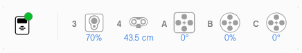
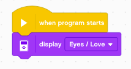
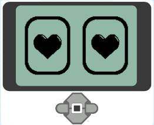
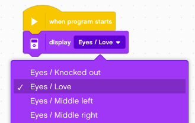
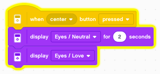
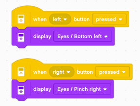
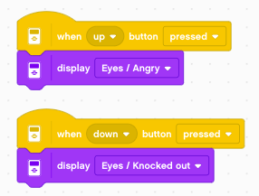

Introduction
============

This tutorial shows how to program the LEGO MINDSTORMS EV3 robot with the **EV3 Classroom** software.

Connect the brick
-----------------

In order to download programs, your robot needs to be connected via USB cable or Bluetooth.
When your brick is connected, the red dot next to the brick icon turns green, and all the attached motors and sensors are shown.

Display eyes
------------

In our first program we are going to display an emotion on the EV3 screen.

To download and execute the program by click on the blue button.

When you download the program, the robot displays this

The program continues to display this image until you stop the program with the red **stop** button.

You can change the image and try again.

Press a button
--------------

Let's use the **center** button to change the image on the EV3.
When pressing that botton, we show a different image (Eyes/Neutral) but just for 2 seconds.
After that we come back to the original image.

When you download and execute the program you can observe, your program get's feedback from the EV3.
Every time you press the center button, the part of the code activated 
will have a **yellow outline** for 2 seconds.

Press left/right
----------------

You can add more buttons to your program.
For example change the image shown when pressing **left/right**.

Press up/down
-------------

You can add even  more buttons to your program.
For example change the image shown when pressing **up/down**.

