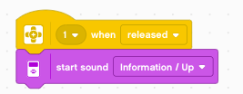

Sensor
======

Sensors perceive the environment and send data to the robot.

Live display
------------

The sensors are connected to the robot via ports 1 to 4.
Small icons at the top of the program show the current values.

- the touch sensor is pressed (value=1)
- the gyros sensor shows 109°
- the color sensor sees the color red (value=5)
- the ultrasound sensor measures a distance of 32.6 cm

The motors are connected to ports A to D.
They contain rotation sensors and display the current angular position: 

- the medium-size motor on port A is at 40°
- the large motor on port B is at 26°
- the large motor on port C is at 56°

Touch sensor
------------

The touch sensor can be used on robot to detect physical touch.
It can be mounted as a bumper or an antenna.

We program it to say something when the touch sensor is pressed.

But we can also program it to do something when it is released.

Color sensor
------------

When the color sensors sees red or green it pronounces these colors

Distance sensor
---------------

Now let's use a different method. We will continously measure the distance and display it.
For this we will use the **forever** loop.

On line 3 we write once the explanation **distance sensor**.
Inside the loop, we write continously the value measured with the disance sensor.

Rotation sensor
---------------

As we have seen in the beginning, all the motors have a rotation sensor built-in.
We can use the wheels as input knobs and display the values.

If you look carefully, you notice the values are positive to one side, negative to the other.
At the start of the program, the value is always 0.

Do you notice a problem?
Let's say you go up to::

    100

This occupies 3 characters. 
Once written, the caracters are not erased when the number becomes smaller.
If you return back to ``99`` the display will now show ``990``.
And when you're back at ``9`` the display will now show::

    900

There is a trick to correct this. 
The green operator **join** allows you to attach a couple of empty spaces after the number.
These will erase any extra digits.

We even can do better. We can add a unit after the number.
Take care to add 1 space before and 4-5 spaces afterwards.
Your string shoud look like this: ``_degrees____``.

