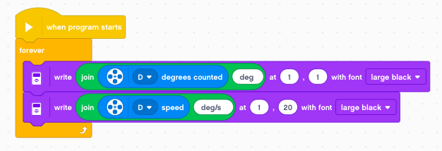

Motor
=====

With the motors the robot can move around.

Display speed and position
--------------------------

Each motor has a rotational sensor.
You can read:

- angular position (degrees)
- angular speed (degrees/sec)

