Remote
======

The EV3 has an infrared sensor. We connect it to port 4.

The sensor has three functions:

- proximity
- remote
- beacon heading

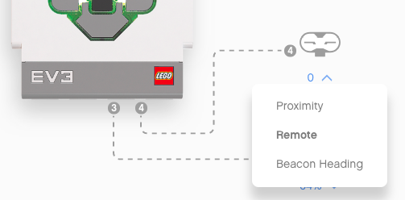

Here we select **remote**.

In order to be able to control multiple robots separately, the remote control has 4 different channels.

The role of the buttons
-----------------------

In the top icon view you can see the sensor state.

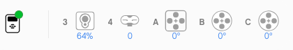

When pushing the buttons on the remote control you will get: 

- 0 : no button
- 1 : left-top
- 2 : left-bottom
- 3 : right-top
- 4 : right-bottom
- 9 : activate beacon button

You can also press **two buttons** at the same time:

- 5 : top two
- 6 : diagonal down
- 7 : diagonal up
- 8 : bottom two
- 10 : left two
- 11 : right two

Detect a button press
---------------------

When a button is pressed on the remote control, we can play a sound.
For exemple for the left side buttons

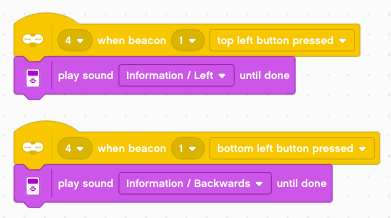

- top left : play **left**
- bottom left : play **backwards**

Push a button and hold it for 2-3 seconds.
Then release it. This will activate the **no left button pressed** event, 
which should rather be called *left button released* event.

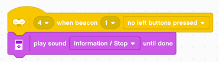

We can program the right side as well.

- top right : play **right**
- bottom right : play **forward**

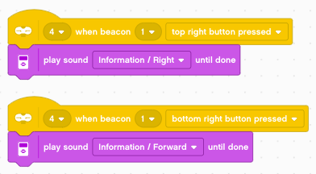

When one of the right buttons is released we do this:

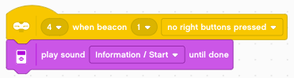

There is one larger button at the top.
It activates the beacon and has a toggle function: 

- pushing it once, turns on the green LED
- pushing it again, turns the LED off

When pressed, we play the sound **activate**

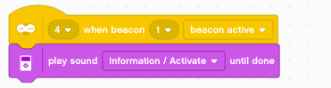

Controlling the robot
---------------------

Now we can program the remote unit to control the movement of the robot.
We use the left buttons to control the **forward/backward** movement.

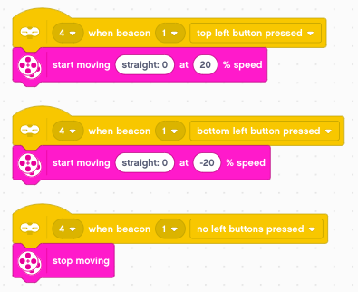

We use the right buttons to control the **left/right** movement.

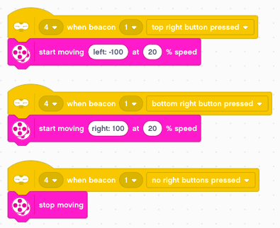

Controlling motor speed
-----------------------

A more flexible way would be if we could also control the speed.
We createa variable **speed** and set it to 0 initially.

- the top button increases the speed by 10
- the bottom button decreases the speed by 10

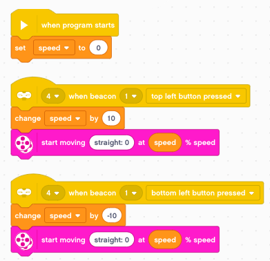

We use the **beacon** button for the emergency brake.

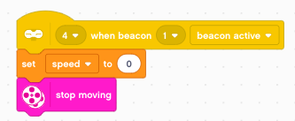

And the right side buttons are used to pivot left and right, as long as the buttons are pressed.

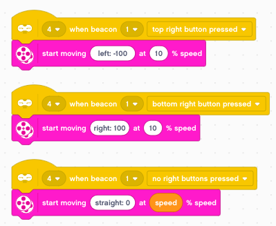

Memorize a path
---------------

