Display
=======

The EV3 can display images and write text.

Display an image
----------------

You can display an image for a specified time duration.
The following program displays neutral eyes for 2 seconds.

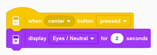

After 2 seconds the screen is cleared and becomes white.
There is also an option for displaying an image continously, without erasing.

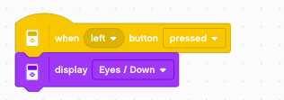

There is a command to clear the screen.

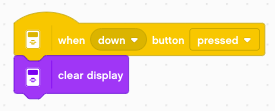

The command **display for X seconds** can be composed from:

- display image
- wait X seconds
- clear display

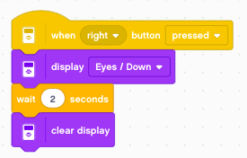

Move the eyes
-------------

You can use the 5 buttons to display eyes which look into the direction of the button.
We start with a neutral position, and can return to that position with the center button.

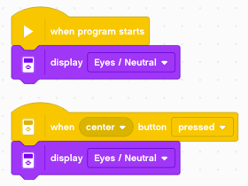

With the **left/right** buttons you can move the eyes to the left and to the right.

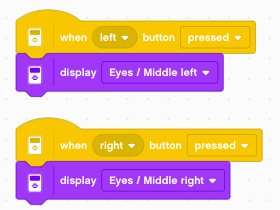

With the **up/down** buttons you can move the eyes up and down.

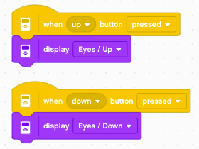

Show a beating heart
--------------------

By displaying two images in repetition we can create a simple animation.
The following loop displays two hearts, a small one and a larger one.

We define a variable **time** which we set to 0.5.
Then we enter a **forever** loop where we:

- play a *click* sound
- display the *large heart* for ``time`` seconds
- display the *small heart* for ``2*time`` seconds

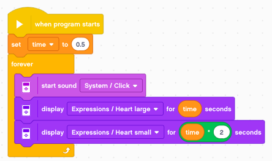

The **up/down** buttons serve to change the **time** variable by increments of 0.1.

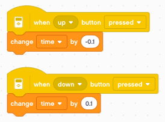

Write lines of text
-------------------

You can write text to one of 12 lines.
The following program sets the variable **x** to 1 and increases it to 12 in a loop,
in order to write text on each line.

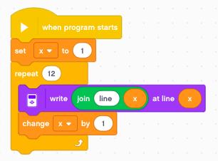

This is the result::

    line 1
    line 2
    line 3
    line 4
    line 5
    line 6
    line 7
    line 8
    line 9
    line 10
    line 11
    line 12

We also can slow it down and write line by line.

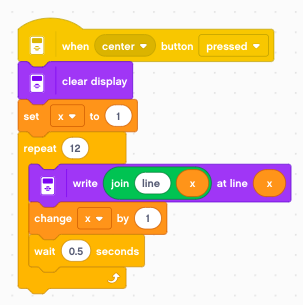

Write in different styles
-------------------------

The second **write** instruction allows to write at any **position (x, y)**
 and to use one out of **6 styles**:

- normal black
- bold black
- large black
- normal white
- bold white
- large white

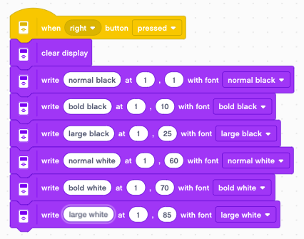

Write at position (x, y)
------------------------

The following program uses two rotary encoders to write the letter **x** at position (x, y).

.. image:: write_xy.png

It produces output like this::

    x=80
    y=20
                        x

Display sensor values
---------------------

Sometimes it is useful to display multiple sensor values on the display.
This program displays 4 sensor values on the first 4 lines.

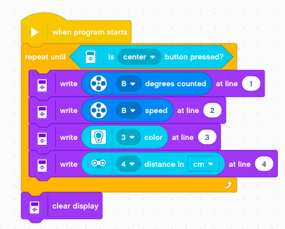

It produces output like this::

    123
    0
    2
    34.5

To better write this line of information we can define a function which:

- adds a text
- writes the number
- adds extra space after it (to erase erroneous digits)
- increments the line number

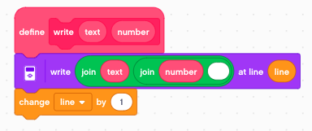

Now we can display these values with an explanatory text (position, speed, etc.)

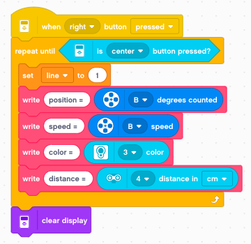

It produces output like this::

    position = 123
    speed = 0
    color = 2
    distance = 34.5

Set the status light
--------------------

The status light around the buttons can be set to: 

- green
- orange
- red

It also can be set to flashing mode called:

- green pulse
- orange pulse
- red pulse

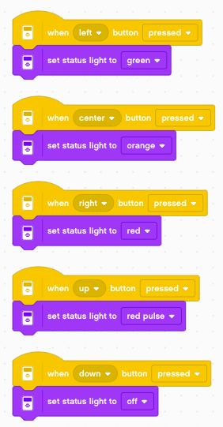
