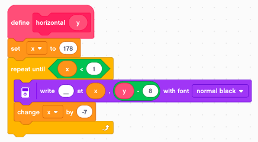
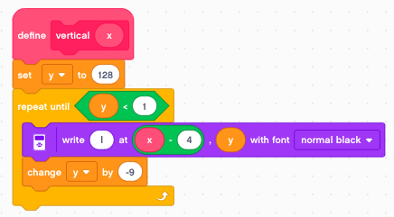
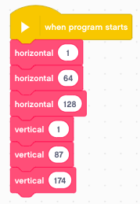
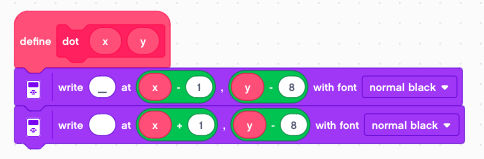
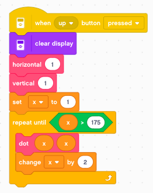

Oscilloscope
============

You will be surprised that the EV3 text display can be tweaked to create an oscilloscope.

The EV3 display
---------------

The EV3 has a 178 × 128 pixel Monochrome display. The corners have these coordinates:

- top-left - (1, 1) 
- bottom-left - (1, 128) 
- top-right - (178, 1) 
- buttom-right - (178, 128) 

It can display:

- 12.8 lines of small text
- 22 characters long

The small character occupy 10x8 pixels. One character is

- 9 pixels high
- 7 pixels wide

For exemple an A is composed of these pixels::

    1 2 3 4 5 6 7
          x
          x
        x   x
        x   x
      x       x
      x       x
      x x x x x
    x           x
    x           x

Characters used
---------------

For the oscilloscope we are going to use the **vertical bar**::

    1 2 3 4 5 6 7
          x
          x
          x
          x
          x
          x
          x
          x
          x

the **horizontal bar** (underscore)::

    1 2 3 4 5 6 7
    
    x x x x x x x

Display a horizontal line
-------------------------

With this information we are ready to display a horizontal line at position **y**. 
We define the variables **x** and **y**. 

We write backwards. 
The reason for this is that the 7x9 pixel character is printed on a 8x10 pixel field.
In fact the left and the top 1-pixel-wide line is erased.

So we initialize x to 178, and decrement by the caracter width of 7.
With regards to y there is a -8 pixel offset.

Display a vertical line
-------------------------

Then we define the **vertical(x)** function.

So we initialize y to 128, and decrement by the caracter height of 9.
With regards to x there is a -4 pixel offset.

Display a grid
--------------

Finally we can draw a grid.

Draw a dot
----------

The function **write text at (x, y)** can place a character at the position (x, y).
To draw an arbitrary curve using dots, we could use the dot (``.``) or the hyphen (``-``).

But the best way is to use an underscore (``_``) followed by a space character.
The space character is offset by 2 pixels and erases the 6 unused pixels of the underscore.
This allows us to draw a dot every 2nd pixel.

The example below draws a diagonal line starting at (1, 1).

Display a scope trace
---------------------

Now we have all the elements to program an oscilloscope.
We start at x=1 and loop until x>175. 
At each iteration we increase x by 2.

The y value is the angular gyro velocity.
We display it  numerically on line 1.
And we plot it with an offset of 64 to the screen.

 .. image:: scope.png

 With a button press we can acquire a single trace of 88 samples.

 .. image:: scope_once.png

Measure continously
-------------------

We can place it inside a loop and measure continously.

 .. image:: scope_loop.png

You can download the programs so far: 
:download:`scope.lmsp <scope.lmsp>`