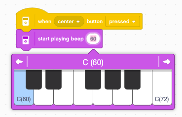
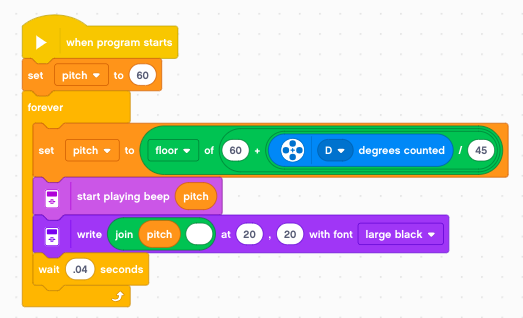
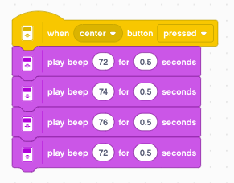
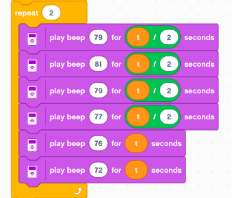

Sound
=====

The EV3 can also play sounds and music.

Say hello
---------

We start with the simple program to say **hello** when pressing the center button.

Count to three
--------------

Next we create a program which counts to three.

There is another block called **start sound**. What is the difference?

Try to count like this.

This block does not wait for the sound to finish. 
It starts immediately the next block and replaces the previous sound which barely has started with the new sound.
Thus this program only plays the last sound (*three*).

To give the program time for the sound,  we have to insert a **wait** block.
This allows to play a sound precisely every second.

Stop all sounds
---------------

The  **stop all sounds** block stops the currently running sound. 
If you press it while running *one, two, three*, 
it stops immeditly the current sound and plays the next one in the sequence.

Download: 
:download:`sound1.lmsp <sound1.lmsp>`

Repeat a sound
--------------

With a loop we can repeat a sound a given number of times.
For example we can repeat the sound *LEGO* three times.

We can also repeat as long a button is pressed.

Finally it's a bit more complicated to start repetition with a first button press
and stop repetition with a second button press.

We need to define a variable **repeating** which we initialize to 0.
Then we enter a **forever** loop. Inside the loop we have an **if** block.

If **repeating = 1** then we play the sound.

.. image:: repeat_forever.png

Next we program the button to toggle the variable **repeating** between the values 0 and 1.
For our feedback, we also print this value to the screen.

Download: 
:download:`sound2.lmsp <sound2.lmsp>`

Start playing a beep
--------------------

The **start playing beep** block starts a beep.
With a keybord we can chose the pitch.

The sound will be playing continously. We can use a second button to stop the sound.

There are 3 different ways to play a beep with only 1 button:

- play a **timed** beep
- play beep **while** button is pressed
- **toggle** beep when button is pressed

Play a timed beep
-----------------

The **play bee** function has two arguments:

- pitch
- duration

It allows to give a duration to the sound.
In the followign example we play the sound for 0.2 seconds.

Play beep while pressed
-----------------------

Buttons have two associated events:

- pressed
- released

We can use these two events to program a button 
which plays a sound only while the button is being pressed.

Toggle beep when pressed
------------------------

The last way is an on/off toggle button.
This method needs a variable **sound** which is going to store the state of the sound:

- 0 = sound is on
- 1 = sound is off

We initialize the variable **sound** to 0 (off) at the start.

When the button is pressed, we toggle the variable **sound** 
by using the expression **sound = 1-sound** 

Then we enter an **if-else** block:

- if sound = 1 (off) we start playing 
- if sound = 0 (on) we stop playing

Download: 
:download:`sound3.lmsp <sound3.lmsp>`

Change volume and pitch
-----------------------

We can control the volume and pitch of of a sound.
First we start by creating two variables called **intensity** and **pitch**.

We set intensity to 50 and pitch to 60.
Then we enter a loop where we first display these two values to teh screen.
Then we produce a short beep repeating every 0.5 second.

Now we can use the 4 buttons to change the two variables **pitch** and **intensity**.

The pitch has been initalized to the value 60. These numbers correspond to::

    60 C
    61 C#
    62 D
    63 D#
    64 E

Use the rotary encoder
----------------------

We can use the rotary encoder to change pitch.
In get the pitch in half-tone steps we: 

- divide by 45 to adjust sensitivity to 45° steps
- offset by 60 to start with the C
- take the floor to get integers (half tones)

Play a melody
-------------

We can play beeps in sequence to play a melody.
For example to play the music of this famous French folk song **Frère Jacques** 

.. image:: jacques.gif

It is quite straightforward to program the first measure.
If we want 120 beats per minute (120 bpm) each beat must be 0.5 seconds.

Change the tempo
----------------

If we want to change the tempo, then it would be better to code the duration of the beep with a variable.
We create the variable **t** (time) and initialize it to 0.5 seconds.
Also, we repeat the first 4 notes in a loop.

With the **up/down** buttons we can select the tempo.

Short and long notes
--------------------

Not all the notes have the same duration. 
The white ones are twice as long. 
We use the expression ``t*2`` as the duration.

On the other hand some other notes only have half the lenght.
We use the expression ``t/2`` for their duration.

And this is the final part.

Download: 
:download:`music.lmsp <music.lmsp>`

