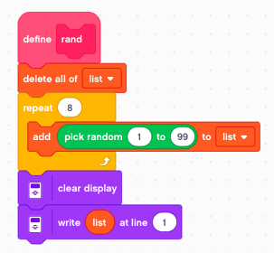
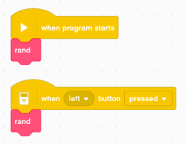
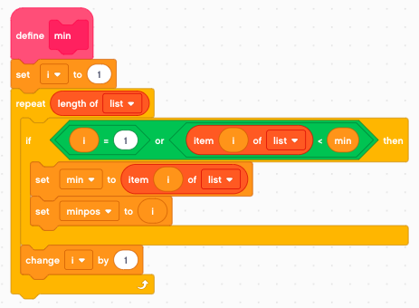
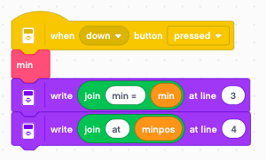
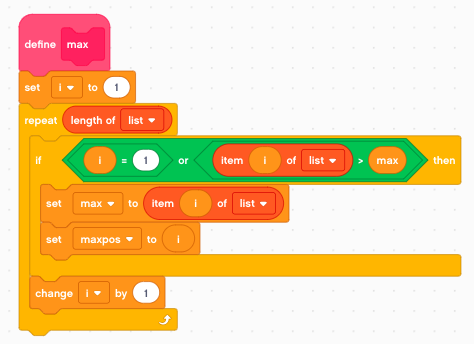
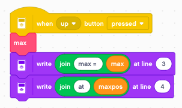
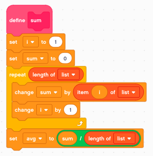
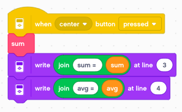

Statistics
==========

In this section we look at a list of numbers and calculate 

- minimum value and its position
- maximum value and its position
- sum
- average

Random list
-----------

For this exercice we use a list with 8 random numbers between 1 and 99.
This way we can print them on the first line of the display.

We call this function in the **start** event and also with the **left** button.

The result of this function looks like this::

    86 35 49 54 37 6 93 62

Calculate the minimum
---------------------

At the first iteration **i=1** we set

- min = list[1]
- minpos = 1

Then we iterate through the rest of the list.
If we find a number which is smaller, we take it as the new minimum.

- min = list[i]
- minpos = i

We call this function with the **down** button.

The result of this function looks like this::

    86 35 49 54 37 6 93 62

    min = 6
    at 6

Calculate the maximum
---------------------

Again, at the first iteration **i=1** we set

- max = list[1]
- maxpos = 1

Then we iterate through the rest of the list.
If we find a number which is larger, we take it as the new maximum.

- max = list[i]
- maxpos = i

We call this function with the **up** button.

The result of this function looks like this::

    86 35 49 54 37 6 93 62

    max = 93
    at 7

Calculate sum and average
-------------------------

To get the sum we add all elements of the list together.
The average is obtained by dividing the sum by the number of elements.

We call this function with the **center** button.

The result of this function looks like this::

    86 35 49 54 37 6 93 62

    max = 422
    avg = 52.75