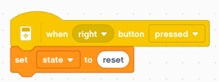

Timer
=====

The EV3 has a timer which starts counting when the program starts.

Display the timer
-----------------

The timer is a varible which is incremented by the micro-processor.
It tells the time in seconds since start-up or the last timer reset.
It has milli-second precision.

The **reset timer** function sets the timer back to 0.

The **when timer** event activates a single event when the timer crosses the given threshold.

Record intermediate times
-------------------------

We can record intermediate times and write them to the screen.

Measure EV3 speed
-----------------

Now we can measure how much it takes for the EV3 to execute its operations.
The idea is to repeat a function 1000 times in a loop to have a good precision.
Let's define a function **timing** which:

- increments the line number
- writes a text
- multiplies the **timer** with 1000 (to obtain microsecons)
- add *us*
- reset the timer for the next mesasurement

We will also use a self-defined function **add**.

These are several loops used to make the timings.

This is the result::

    loop: 43 us
    set: 62 us
    mul: 92 us
    sin: 101 us
    fun: 927 us

This gives us a rough idea how long different blocks take to execute: 

- 43 us for a loop
- 20 us for a set (variable assignment)
- 30-40 us for a math operation (add, mul, sin, etc.)
- 900 us for a user-defined function (My block)

While basic operations take 50-100 us, the user-defined functions have a 20-times overhead.

Kitchen timer
-------------

To program this timer we will use the technique of the **state machine**.
In our case we have 3 states:

- reset
- count
- alarm

We define 3 variables:

- **delay** is the duration of the count-down in seconds
- **state** is one of the strings *reset, count, alarm*
- **timeout** is the point in time of the alarm

In the **reset** state we set the delay with the **up/down** buttons.

With the **center** button we set the **timeout** to **timer + delay** and switch to the **count** state.

With the **left** button we stop the alarm sound and return to the **reset** state.

The state machine consists of a **forever** loop with 3 *if** blocks which check for the 3 states.

- in **reset** state, we just show the delay
- in **count** state, we show the count-down
- in **alarm** state, we repeat the alarm sound

Notice here, that we never need to reset the timer.
This can be important in timing applications for not losing precision.

The timer is displayed in line 1 and the state in line 2.

