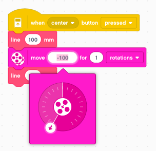

Drawing robot
=============

In this chapter we build a drawing robot.

This robot uses three motors:

- the small one to lift the pen
- the large ones to move

To have a higher precision, it uses the small wheels.
The pen is place right in the center between the two wheels.

Lift the pen
------------

Try to turn up the small motor lever to the verticl. 
If the horizontal postion was 0°, it will be -90°.

The angle decreseases as we lift the pen.
We can now program the **up/down** buttons to move the pen.
As we want to make this movement as quick as possible, we set the speed to 100%.

For the down movement we set a time. This is necessary, as we let the motor hit a mechanical limit.
This trick is a calibration without using a sensor. We move the motor to a known position.

- up: move by 45°
- down: move during 0.1 seconds

Define functions
----------------

A program becomes much readable and versatile when using function.
Let's define two functions **up** and **down**

Now we can use this two functions and associate them with the buttons.
The code is much more readable.

But there is another advantage. In a large program, we may use the pen in many places.
If we change the pen mechanics, or correct a bug with the pen up/down movement, 
there is one single place to make such a correction

Move the robot
--------------

We go no to moving the robot.
We are going to use motors B and C for movement.
In order to obtain precise drawing results, we set the speed to 20%.

So how much does the robot advance with 1 rotation ?
It is difficult to measure from the robot, 
but it becomes easy if the robot is going to draw a line.

Now you can measure the line. It is about 94 mm long.

Create a move function
----------------------

Now we have all the information to create a **move** function with an argument.
So go ahead and create a new function with one parameters and these labels.

With the rule of three we can calculate the number of rotations for any distance.
The number of rotations is **distance/94**.

Now we can call this function with a specfic argument. 
For example 50 mm. Try it and measure the length of the line.

Create a line function
----------------------

We can go one step further, and directly create a **line** function.

We can now call the **line** function to draw a line of for example 120 mm.

Turn the robot
--------------

Now let's turn the robot on place.
First we draw a line 100 mm. Then we pivot by 1 wheel rotation to the left. 
And finally we draw a second line of 100 mm.

We find that the robot turns by 82 degrees.
This allows us to create a **turn** function.

Now we can call this function with a 90° angle.

Draw a polygon
--------------

We have now everything needed to draw a regular polygon.
We just use a loop to repeat **n** sides of a regular polygon.
Then we turn an angle of **360/n** degrees.
For example we can draw a hexagon with a side length of 50 mm.

Now we can turn this into a function.

Now we can use the **polygon** function to draw a pentagon with a side length of 40 mm.

.. image:: polygon_call.png

Draw a star
-----------

The the star polygon is drawn exactly as the polygon, 
but the turning angles are multiples of the normal polygon angle.
For example, turning **360/5** results in a pentagon.
However turning twice that angle, **2x360/5**, creates a 5-pointed start.

We create a **star** function which allows as to draw **n/m** star polygons.

Now lets draw such a 5-pointed star

You can download the programs so far: 
:download:`draw1.lmsp <draw1.lmsp>`

Draw a letter
-------------

We have everything in place to draw a letter. 
For exemple to draw the letter **E** inside a rectangle of 30 x 40 mm
we do this:

At the end we place the robot to the beginng of the next letter.

A function with 3 arguments
---------------------------

If you look at the previous program, you notice it's pretty long.
But it consists of a sequence of *line, move* and *turn* functions.
We could combine these three functions in one.
Let's make this function with 3 arguments:

Using this new function, we can reduce the number of function calls from 15 to 7.
It is easier to understand, as each line corresponds now to a segment of the letter.

Define letters as functions
---------------------------

The next step is to define a function for each letter.
We define the letter **E**

We define the letter **L**

And now we can write the word **ELLE**

Draw numbers in 7-segment style
-------------------------------

