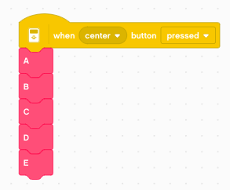

Morse code
==========

In this section we program the robot to create Morse code.

Samuel Morse invented this code which uses dots and dashes to encode letters.
He looked at the frequency of letters and assigned the shortes codes to the most frequent letters.

Here is the code

.. image:: morse_chart.png

Create a dot

Drawbot
-------

This section uses the Drawbot from the previous section.
You will use these functios

You can download this program which contains already this functions as your starting point: 
:download:`draw.lmsp <draw.lmsp>`

Play a dot or dash
------------------

Let's start with drawing a dot. 
That's just a line of lenght 0 mm.
We play a sound which is defined by the duration it takes to draw that dot.

The dash is the same, just 3 mm long.

.. image:: dash.png

The basic symbols are separated by 3 mm of distance.

Make this a function
--------------------

We could now make two functions **dash** and **dot** and place the 4 lines of code inside.
However since they are very similar, we will make just **dash** and give it a parameter.

Now we can call it with these two parameters

- 0 to draw a dot
- 1 to draw a dash (3 mm long)

Draw the Morse code for Q
-------------------------

Now we can program for example the code for the letter Q.
It's dash-dashes-dot-dash. We have to add an extra 3 mm space to separate it from the next letter.

We could define a fonction for all 26 letters.
But there is a better way

Decompose a sequence with modulo
--------------------------------

The **modulo** function or **mod** function returns the result of a divison.
In our case we will use **mod 10** which will give us the reminder of a divison by 10,
or in other words it gives us the last digit of the number::

    21011 mod 10 = 1
    2101 mod 10 = 1
    210 mod 10 = 0
    21 mod 10 = 1
    2 mod 10 = 2

The function **floor** returns the integer part of a number we get from the division by 10::

    floor 2101.1 = 2101
    floor 210.1 = 210
    floor 2.1 = 2

It is still the letter Q, but the sequence is read from the back. 

Create a function
-----------------

We can now create a function which encodes a number sequence into Morse code.
The number sequence has to be defined in reverse order. 
The code is composed of 3 digits:

- 0 to indicate a dot
- 1 to indicate a dash
- 2 to indicate the end of the sequence

The end marker is necessary because in numbers preceding zeros are ignored.

The **encode** function is used to define a function for each letter (A, B, C, etc.)

We can compose words by using these functions.
As en example we print the letters ABCDE.

You can download the programs so far: 
:download:`morse.lmsp <morse.lmsp>`

