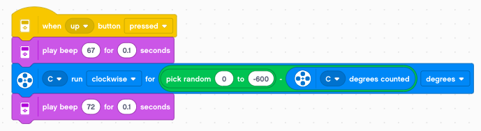

Robot Arm
=========

In this chapter we control a robot arm.
You can:

- lift the arm
- rotate the arm
- open and close the hand

.. raw:: html

    <iframe width="560" height="315" src="https://www.youtube.com/embed/oMXIWePpfCo" 
    frameborder="0" allow="accelerometer; autoplay; encrypted-media; gyroscope; 
    picture-in-picture" allowfullscreen></iframe>

You can find the 
`construction guide <https://le-www-live-s.legocdn.com/sc/media/lessons/mindstorms-ev3/building-instructions/ev3-model-core-set-robot-arm-h25-56cdb22c1e3a02f1770bda72862ce2bd.pdf>`_
to build the robot arm here. 

Motors and sensors
------------------

When you connect the robot you will see these sensors and motors:

A rotation in the clockwise direction has this effect:

- motor A : opens the hand
- motor B : lowers the arm
- motor C : turns the arm clock-wise

The two sensors serve to detect the range limit of the arm.

The first thing we will do is to set the speed of the 3 motors to 20%.

Lift the arm
------------

We program the **up/down** buttons to move the motor B by 30° increments.

Rotate the arm
--------------

We program the **left/right** buttons to move the motor C by 45° increments.

Move continously
----------------

Now we change the program. We move the motor as long as we press the button.
For this we use two events:

- the **pressed** event
- the **released** event

And for the other direction

Limit the lift
--------------

In order to calibrate the robot, two sensors are attached to the robot:

- the light sensor detects the upper limit of the arm,
- the touch sensor detects the rotational limit of the arm.

Move the motor upwards and look at the light value. 
It will go from 5% up to 30%.

Let's program the **center** button to start the calibaration movement.
We move the arm up until the reflected light intensitiy is larger then 25%.
Then we stop the motor and play a short beep.

We also reset the rotation sensor, so that this upper value becomes 0°.
So when the robot is calibrated, we always can know its absolute angles.

You can lower the arm now and find the angular postion when the arm touches the table.
It should be close to 280°.

You can download this program: 
:download:`arm2.lmsp <arm2.lmsp>`

Limit the rotation
------------------

Again, let's program the arm that it moves as long a button is pressed.
For this we use these two events:

- the **button pressed** event
- the **button released** event

And do it also the other way.

Move the arm slowly to the left and try to find the position where the touch sensor detects the limit position.
It's when the arm faces completely backwards.
Like before, we program the **center** to go automatically to that position.

When the limit position is detected, we sound a short beep and reset the rotation sensor.
This position becomes the new zero.

Now move the arm manually to the front position.
The sensor position should be about -600°.

Display current position
------------------------

It's quite useful to display sensor information directly on the brick.
Of course now we can see the sensor values on the computer, but the 
brick can also run without a computer being attached.

In order to display the current sensor values,
we use the **when program starts** event to start a **forever** loop.
Inside this loop we write the sensor value to the screen.

In order to see it well, we place it at position (30, 30) 
and we select a large black font.

Go to a random position
-----------------------

Now that we have calibrated the rotation and established it's allowd range,
we can control the arm. Any value in the range [0 .. -600] is allowd.

We can use the **pick random** function to get such a value.
In order to know the distance the motor has to move we calculate the difference
**target - current**. 

We mark the beginning and end of this random move with two different sounds.

You can download this program: 
:download:`arm3.lmsp <arm3.lmsp>`

Create a calibrate function
---------------------------

Now it's time to define our first function.
The calibration needs to be done each time at the beginning of the progam.
Let's define a function and execute it automatically at start.

Create a new **My Block** and define it like this:

Record arm positions
--------------------

An industrial robot needs to go to specific positions.
It must remember these positions. We are going to program the arm so that it can memorize positions.

We make a new variable **n**

This variable will be used to count each memorized position.
In the **start** event we set the variable n to 0.

We place all the commands which need to be done once at the beginning.
Then we enter a **forever** loop to repeatedly display the current sensor position.

Then we create a **button down** event which does:

- write the current sensor value to line **n** on the screen
- increment the variable **n** by 1

After calibration has finished, move the arm with the **left/right** button.
Then press the **down** button to write the current position to the screen.
You will get something like this::

    -234
    -345
    -435
    -534

Saving values in a list
-----------------------

So far these values have just been written to the screen.
They are not registered in any list.

Create a new list called **positions**.

Now we have to change the **button down** event to save the current position in the list.

Replaying the list
------------------

Now we are ready to program the **replay** function.
We use the **center** button event.

We reset the variable n to 1, to point to the first element in the list.
Then we enter a loop which will repeat the number of times there are elements in the list.

Inside the loop we:

- display the current item number (pos 1, 2, 3, ...)
- calculate the **delta** value the arm has to move
- move the arm to the new position
- play a beep
- increment the variable **n** by 1
- wait for 1 second

Reset the list
--------------

At the end of the replay the variable **n** will be pointing at the next possible position.
It is possible to add more values to the list.
At any time you can replay the list.

In order to reset the list we use the **up** button.

It does:

- delete the list
- reset the variable n to position 1
- clear the display

You can download this program: 
:download:`arm4.lmsp <arm4.lmsp>`

Open and close the hand
-----------------------

To operate the hand we control motor A.
This motor does not have a limit sensor. 
We use a little trick to find the end position. We close the hand for about half a second.
Once the hand is closed, the motor cannot move any further and it will stop shortly after.
This gives a defined state. From there we can go 90° the other way, to open the hand.

- closing for 0.5 secondes (time mode)
- opening 90° (rotation mode)

You can try to put an object between the claws and close the hand. The object will be firmly held.

Remember the state
------------------

Since we only have 5 buttons, it would be convenient to use just one button to operate the hand.
This button could be used to toggle between the two states: 

- open 
- closed

We use a variable **hand** to keep this two states as a string.
We define the hand to be closed at the start of the program.

.. image:: hand_init.png

Based on the state of the variable **hand** we open the hand if it's closed 
and close it if its open.

Inside the **if-else** block the state of the variable is inverted.
At the end, the current state of the hand is printed to the screen in large letters.

You can download this program: 
:download:`arm5.lmsp <arm5.lmsp>`

