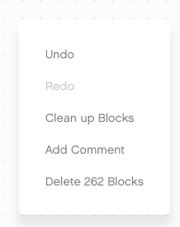
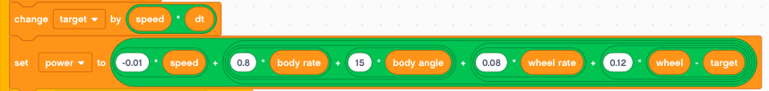

Gyro Boy
========

Gyro Boy is a self-balancing robot.

.. raw:: html

    <iframe width="560" height="315" src="https://www.youtube.com/embed/wejXE9jlszo" 
    frameborder="0" allow="accelerometer; autoplay; encrypted-media; 
    gyroscope; picture-in-picture" allowfullscreen></iframe>

Reverse engineering
-------------------

In this section we will do a bit of reverse engineering. 
The code for a balancing robot is quite complex.

You can find the official project in the EV3 Classroom under
**Home > Core Set Models > Gyro Boy**. 

Or you can download the file here:
:download:`Gyro Boy 1.lmsp <Gyro Boy 1.lmsp>`

The initial file has a total of 262 blocks.
You can see this in the contextual menu.

Let's try to simplify this program and keep only the essential blocks.

- remove the user interface start loop (down to 202)
- remove calibrate gyro offset (169)
- simplify timing dt = t-t0 (163)
- simplfiy angular speed and angle (152)
- remove averaging of motor position (137)
- delete clear screens, integrate control loop timing (132)

Finally we manage to go down to 98 blocks.

You can download the file here:
:download:`Gyro Boy 2.lmsp <Gyro Boy 2.lmsp>`

Startup
-------

At startup we:

- call the **reset** function
- do a startup sound
- display awake eyes
- set the lights to green pulsing

This is the reset function which:

- resets both motor encoders to 0
- sets the body angle to 0
- sets speed and steer to 0 (remote control)

Get the loop time
-----------------

The first part is about timing. 
We need to know the time **dt** it takes for the feedback loop.
The loop time dt is used to calculate : 

- angle from speed : a = (s1-s0) * dt
- speed from angle : s = (a1-a0) / dt 

This is a classic 3-line algorithm.

- read the new timer value **t**
- calculate the increment **dt = t - t0**
- set the old timer value to the new one

Angle from rate
---------------

Then we calculte the angle from the angular velocity. 
Why not reading the light-blue built-in **gyro angle** variable ?

Well, it's less precise and it does not seem to be possible to read both, 
angular velocity and angle at the same time.

Mathematically speaking we obtain the angle by integrating the angular speed.
That's what we are doing here. The formula for discrete integration is::

    angle += rate * dt

.. image:: body_angle.png

Rate from angle
---------------

For the wheel we are in the opposite position.
We measure an angle, and calculate the rate (speed) eed with a derivative.

First we measure the wheel angle, which is the sum of both rotation sensors.
If the robot moves in a straight line, they add up.
If the robot pivots and stays in place, they cancel each other. 

Again, why not use the dark blue **motor speed** variable ?

Well, it's less precise, because we don't know exactly what dt is used internally.

The formula for discrete derivation is::

    rate = (angle - angle0) / dt

The PD controller
-----------------

The robot tries to stay at the target position. 
The target position is the path lenght when speed is integrated over time::

    target += speed * dt

In technical terms we have a PD controller: P for proporional control and D for Derivative control.

The magic of the control system happens here.
The power is a sum of 5 weighted quantities which describe the state.

Concerning the signs we have this situation:

- positive body angle - robot leans forward
- positive body rate - robot falls forward
- positive wheel angle - wheels are ahead of target
- positive wheel rate - wheels move forward

In all this cases the power must be positive, to counter the tendency of the robot to fall.

Motor control
-------------

The last part controls the motors.

First we limit the power to the range [-100 .. 100].
We use a little trick to get the sign::

    sign(power) = power/abs(power)

Each time we are in normal regime (not in saturation) we reset the **fall time**.

We use differential steering for the two motors. 
If the saturation regime lasts more then 1 second, we stop running.

Shutdown when falling
---------------------

If the robot falls and runs in saturation for more than 1 second, we:

- stop both motors
- set the status light to red pulses
- show pinched eyes
- play the spead down sound
- wait for 3 seconds

Driving with the remote control
-------------------------------

It's now very easy to add remote control functionalty.
First we use the large button to implement an emergency stop.

We use the left side buttons to control speed.

.. image:: remote_speed.png

and we use the right side buttons to steer.

