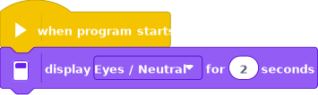

Annex
=====

In this annexe we look at the file format and other technical stuff.

File format
-----------

The **EV3 Classroom** application stores projects with a **.lmsp** extension.
You can remember this as *LEGO MINDSTORMS Scratch Program*.

When you create your first project, it is called **Project 1.lmsp**

The file inspector shows:

- Type: EV3 Project Archive
- Size: 40 985 bytes (41 KB)

Open the .lmsp file
-------------------

The **Project 1.lmsp** is in fact a ZIP file. You can:

- make a copy of it,
- change the extension from .lmsp to .zip
- decompress the ZIP file

You will get a **Project 1** folder with 3 files:

- icon.svg
- manifest.jsn
- scratch.sb3

The icon.svg file
-----------------

This file contains an image of the program, probably to be displayed in **Home > Recent projects**.

The manifest.jsn file
---------------------

This file contains information about the connection, zoom level, position, etc.

.. literalinclude:: manifest.json
  :language: JSON

The scratch.sb3 file
--------------------

This is a **SB3 file**, based on the MIT Scratch 3.0 format. 

You can again:

- replace the .sb3 extension with .zip
- decompress the archive

You will get a folder called **scratch** which contains:

- svg file
- wav file (Meow)
- png file
- project.json file

This JSON file contains:

.. literalinclude:: scratch/project.json
  :language: JSON
